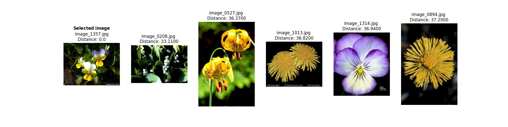
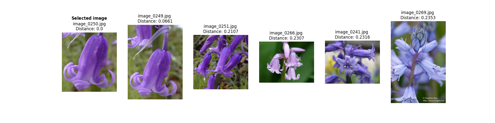

# Assignment 1: Simple image search algorithm

## About

This project uses ``opencv`` and the ``NearestNeighbors()`` model from scikit-learn to create a simple image search algorithm that compares a *target flower* with the other flowers in the ``17 Category Flower Dataset``, and saves the results as a CSV file and a plot (OPTIONAL) in the ``out`` directory. 

The ``src`` directory contains two scripts:

- **image_search_with_cv2.py:** Creates a normalized color histogram for each flower, calculates the distances between the target flower and the dataset, and returns the closest matches to the target flower.

- **image_search_with_knn.py:** Extracts features from each image in the dataset and uses the``kneighbors()`` function to calculate the distances between the target flower and the dataset to find the nearest neighbors.


### Data

Download the [17 Category Flower Dataset](https://www.robots.ox.ac.uk/~vgg/data/flowers/17) dataset from the Visual Geometry Group at the University of Oxford and save it in the ``in`` directory. 

### Model

*For this project, the VGG16 model is loaded without the top classification layers, marking the remaining layers as nontrainable while adding the following layers to enhance model performance.*

NearestNeighbors() and `kneighbors()`` function

*Husk at opdatere filepaths og rename them og dobbeltjek fil download. Jeg kan se at de indeholder tekstfiler, så husk at rette if endswith til jpg*

##  File Structure

```
└── assignment_1
        |
        ├── in
        │   └── flowers (contains 1360 images)
        │      
        ├── out
        |   ├── cv2_image_comparison.csv
        |   ├── cv2_image_comparison_plot.png
        |   ├── knn_image_comparison.csv
        |   └── knn_image_comparison_plot.png
        |
        ├── src
        │   ├── image_search_with_cv2.py
        │   └── image_search_with_knn.py
        │     
        ├── readme.md
        ├── requirements.txt
        ├── run.sh
        └── setup.sh
```
## Usage

If you want replicate this project, follow the steps outlined below. The instructions will guide you through setting up the environment, running the script, and plotting the results while helping you understand the available command-line options for customizing the training process. 

### Pre-Requisites

*Please makes sure to install the following requirements before running the script.*

**Python**: version 3.12.3

### Installation

**1.** Clone the repository using Git.
```sh
git clone https://github.com/trinerye/visual_analytics_2024.git
```

**2.** Change directory to the assignment folder.
```sh
cd assignment_1
```

**3.** Run ``setup.sh`` to install the dependencies needed for this project. 
```sh
bash setup.sh
```
**4.** Run ``run.sh`` to activate the environment and run the main script. 

*Select the script you want to run and comment out the other one.  
```sh
bash run.sh
```
```sh
...
# Activate the environment (Unix/macOS)
source ./A1_env/bin/activate

# Run the code
python src/image_search_algorithm.py -i "image_1357.jpg" -p &
python src/image_search_with_knn.py -i 249 -p

# Deactivate the enviroment
deactivate
```

### Command Line Interface  

This project supports several command-line flags to customize the training process. *See table for reference.*

*For the cv2 script*

|Flag      |Shorthand|Description                                                                     |Type|Required|
|----------|---------|--------------------------------------------------------------------------------|----|--------|
| --image  | -i      |Filename of the image you want to compare with the dataset, e.g. image_0001.jpg |str |TRUE    |
| --print  | -p      |Saves a plot of the results in the out directory                                |bool|FALSE   |

*For the knn script*


|Flag      |Shorthand|Description                                                                        |Type|Required|
|----------|---------|-----------------------------------------------------------------------------------|----|--------|
| --index  | -i      |Index of the image you want to compare with the dataset, e.g. 0 for image_0001.jpg |int |TRUE    |
| --print  | -p      |Saves a plot of the results in the out directory                                   |str |FALSE   |

## Results 

Write something here

### Comparisons

*Remember to update the filepath once I run the script again*





Something about how the image search algorithm is faster, but the knn prediction is more accurate.


### Limitations and future improvements 

...


