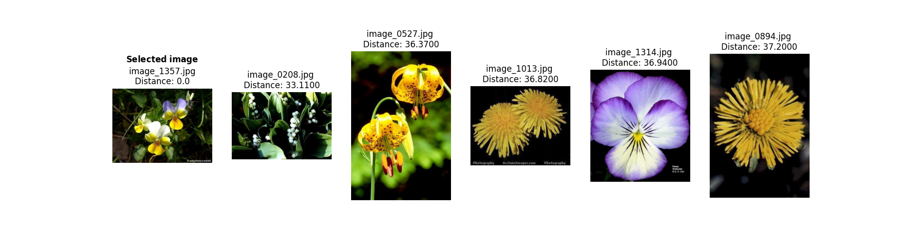
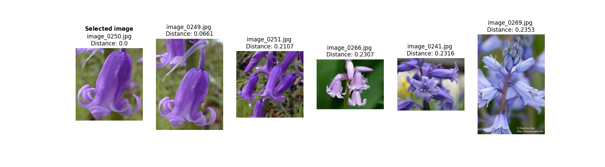

# Assignment 1: Simple image search algorithm

## About

This project uses ``opencv`` and the ``NearestNeighbors()`` classifier from scikit-learn to create a simple image search algorithm that compares a *target flower* with the other flowers in the ``17 Category Flower Dataset``, and saves the results as a csv file and a plot (OPTIONAL) in the ``out`` directory. 

The ``src`` directory contains two scripts:

- **image_search_with_cv2.py:** Creates a normalized color histogram for each flower, calculates the distances between the target flower and the dataset, and returns the closest matches to the target flower.

- **image_search_with_knn.py:** Uses the [VGG16](https://keras.io/api/applications/vgg/) model to extract features from each image in the dataset, then uses the NearestNeighbors classifier to calculate the distances between the target flower and the dataset to find the nearest neighbors.


### Data

Download the [17 Category Flower Dataset](https://www.robots.ox.ac.uk/~vgg/data/flowers/17) dataset from the Visual Geometry Group at the University of Oxford, rename the ``jpg`` folder to ``flowers`` and save it in the ``in`` directory. 

### Model

According to the documentation, the [cv2.compareHist()](https://docs.opencv.org/3.4/d8/dc8/tutorial_histogram_comparison.html) uses chi-square statistics to measure the distances between the target image and the dataset. On the other hand, the [NearestNeighbors()](https://scikit-learn.org/stable/modules/generated/sklearn.neighbors.NearestNeighbors.html#sklearn.neighbors.NearestNeighbors.kneighbors) model compares the target image with the dataset by calculating the Euclidean distance between the one-dimensional vectors to find the nearest neighbors.

Before calculating the Euclidian distance, the image features are extracted using VGG16, a Convolutional Neural Network with the following parameters. 

| Parameter      | Value        | Type | 
|----------------|--------------|------|
| weights        | imagenet     | str  |
| include_top    | False        | bool |
| pooling        | avg          | str  |        
| input_shape    | (224, 224, 3)| int  |

##  File Structure

```
└── assignment_1
        |
        ├── in
        │   └── flowers (contains 1360 images)
        │      
        ├── out
        |   ├── cv2_image_comparison.csv
        |   ├── cv2_image_comparison_plot.png
        |   ├── knn_image_comparison.csv
        |   └── knn_image_comparison_plot.png
        |
        ├── src
        │   ├── image_search_with_cv2.py
        │   └── image_search_with_knn.py
        │     
        ├── readme.md
        ├── requirements.txt
        ├── run.sh
        └── setup.sh
```
## Usage

If you want to replicate this project, follow the steps outlined below. The instructions will guide you through setting up the environment, running the script, and plotting the results while helping you understand the available command-line options for customization.  

### Pre-Requisites

*Please makes sure to install the following requirements before running the script.*

**Python**: version 3.12.3

### Installation

**1.** Clone the repository using Git.
```sh
git clone https://github.com/trinerye/visual_analytics_2024.git
```

**2.** Change directory to the assignment folder.
```sh
cd assignment_1
```

**3.** Run ``setup.sh`` to create an environment and install the dependencies needed for this project. 
```sh
bash setup.sh
```
**4.** Run ``run.sh`` to activate the environment and run the main script. 
  
```sh
bash run.sh
```
```sh
...
# Activate the environment (Unix/macOS)
source ./A1_env/bin/activate

# Run the code
python src/image_search_algorithm.py -i "image_1357.jpg" -p 
python src/image_search_with_knn.py -i 249 -p

# Deactivate the enviroment
deactivate
```

### Command Line Interface  

This project supports several command-line options to customize the script. *See table for reference.*

>**Color histogram comparison (cv2)**

|Flag      |Shorthand|Description                                                                     |Type|Required|
|----------|---------|--------------------------------------------------------------------------------|----|--------|
| --image  | -i      |Filename of the image you want to compare with the dataset, e.g. image_0001.jpg |str |TRUE    |
| --print  | -p      |Saves a plot of the results in the out directory                                |bool|FALSE   |

<br>

>**K-Nearest Neighbor**

|Flag      |Shorthand|Description                                                                        |Type |Required|
|----------|---------|-----------------------------------------------------------------------------------|-----|--------|
| --index  | -i      |Index of the image you want to compare with the dataset, e.g. 0 for image_0001.jpg |int  |TRUE    |
| --print  | -p      |Saves a plot of the results in the out directory                                   |bool |FALSE   |

## Results 

You can find a CSV file and a plot of the image comparison results in the ``out`` directory.

>**Color histogram comparison (cv2)**



<br>

>**K-Nearest Neighbor**



Since the Euclidian distance is calculated based on feature extractions rather than a probability distribution, the nearest neighbor classifier can access more information about the images than just the distribution of colors. Although the simplicity of the image data makes the cv2 approach faster, the knn prediction is more accurate, as elements such as background colors and other noise influence the result of the color histogram comparison more than the actual flower itself.. 


