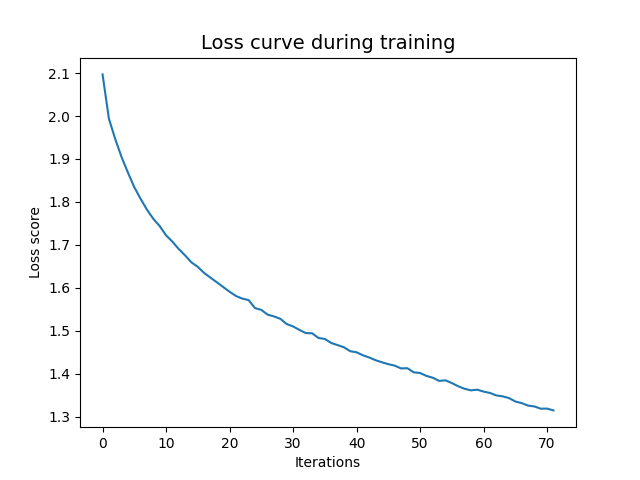

# Assignment 2: Classification benchmarks with Logistic Regression and Neural Networks

## About

This project uses ``scikit-learn`` to classify images from the ``Cifar-10`` dataset which have been greyscaled, normalized, and reshaped to fit the requirements of the ``LogisticRegression()`` and ``MLPClassifier()`` classifiers. 

The ``src`` directory contains two scripts:

-  **logistic_regression.py:** Trains the logistic regression classifier and saves a classification report in the ``out`` directory

- **neural_network.py:** Trains the neural network classifier and saves a classification report and a plot of the loss curve in the ``out`` directory

- **preprocessing_images.py:** Preprocesses the images from the cifar-10 dataset

Additionally, the trained models are stored in the ``models`` directory to ensure reproducibility.

### Data

The cifar-10 dataset consits of 60000 32x32 colour images divided into 10 categories. You can see more information about the cifar-10 dataset [here](https://www.cs.toronto.edu/~kriz/cifar.html)

You do not need a data folder for this repository as the cifar-10 dataset can be downloaded from the ``tensorflow.keras.datasets`` as follows:

```sh
from tensorflow.keras.datasets import cifar10

(X_train, y_train), (X_test, y_test) = cifar10.load_data()
```
### Model

This project was built using the [LogisticRegression](https://scikit-learn.org/stable/modules/generated/sklearn.linear_model.LogisticRegression.html) and the [MLPClassifier](https://scikit-learn.org/stable/modules/generated/sklearn.neural_network.MLPClassifier.html) classifier from scikit-learn with the following parameters. 

>**Logistic Regression Classifier**

| Parameter      | Value      | Type | 
|----------------|------------|------|
| tol            | 0.1        | int  |
| solver         | saga       | str  |
| multi_class    | multinomial| str  |        
| random_state   | 42         | int  |
| early_stopping | True       | bool |
| verbose        | 1          | int  |

<br>

>**Neural Network Classifier**

| Parameter          | Value   | Type |
|--------------------|---------|------|
| activation         | relu    | str  |
| tol                | 0.001   | int  |
| solver             | adam    | str  |
| hidden_layer_sizes | (128, ) | int  |
| max_iter           | 200     | int  |        
| random_state       | 42      | int  |
| early_stopping     | True    | bool |
| verbose            | 1       | int  |

Both classifiers utilize ``early_stopping``, which terminates the training process if the validation score did not improve more than tol=0.000100 for 10 consecutive epochs, ensuring that the models do not overfit the training data and reducing the run time. 

##  File Structure

```
└── assignment_2
        |
        ├── models
        │   ├── logistic_regression_classifier.joblib
        │   └── neural_network_classifier.joblib
        │      
        ├── out
        │   ├── logistic_regression_classification_report.txt
        |   ├── neural_network_classification_report.txt
        |   └── loss_curve.png
        |
        ├── src
        │   ├── logistic_regression.py
        │   ├── neural_network.py
        │   └── preprocessing_images.py
        │     
        ├── readme.md
        ├── requirements.txt
        ├── run.sh
        └── setup.sh
```

## Usage

To run this project, follow the steps outlined below. These instructions will guide you through setting up the environment, preprocessing the cifar-10 dataset images, and training the logistic regression and neural network classifier. 

### Pre-Requisites

*Please makes sure to install the following requirements before running the script.*

**Python**: version 3.12.3

### Installation

**1.** Clone the repository using Git.
```sh
git clone https://github.com/trinerye/visual_analytics_2024.git
```

**2.** Change directory to the assignment folder.
```sh
cd assignment_2
```

**3.** Run ``setup.sh`` to create an environment and install the dependencies needed for this project. 
```sh
bash setup.sh
```
**4.** Run ``run.sh`` to activate the environment and run the main script. 
```sh
bash run.sh
```

```sh
...
# Activate the environment (Unix/macOS)
source ./A2_env/bin/activate

# Run the code
python src/logistic_regression.py 
python src/neural_network.py

# Deactivate the enviroment
deactivate
```

## Results 

In the ``out`` directory, you can find the classification reports from both models and a plot of the loss curve illustrating the performance of the neural network classifier. 

Examining the classification reports in the output directory reveals that the test dataset is well-balanced, with each class equally represented. Comparing the weighted results also reveals that the neural network classifier performs better than the logistic regression classifier, which suggests that this model architecture fits better with the complexity of the data.

>**Logistic Regression Classifier**

|Metrics         |Precision   |Recall|F1-Score|
|----------------|------------|------|--------|
|weighted average|0.31        |0.31  |0.31    |

<br>

>**Neural Network Classifier**

|Metrics         |Precision   |Recall|F1-Score|
|----------------|------------|------|--------|
|weighted average|0.44        |0.43  |0.43    |

An explanation for this might be that models using logistic regression tend to perform better on simple data or smaller datasets, such as binary classification problems like spam detection (Holt-Nguyen, 2023). In contrast, the neural network excels at multi-class classification, which likely explains its higher performance. However, a downside to neural networks is the need for a large dataset to train the model effectively, which makes the training process computationally heavy.

Nevertheless, neither one performs exceptionally well, with a weighted F1-Score of 0.31 for the logistic regression classifier and 0.43 for the neural network classifier, which suggests that these models are not well suited for working with this type of image data. An explanation could be that the image data must be converted into a one-dimensional vector to fit the models, resulting in a loss of information since colour images, like the cifar-10 dataset, have three colour channels. 



Looking at the loss curve belonging to the neural network classifier, one immediately notices that the validation loss curve is missing, as scikit-learn does not have a validation subset like tensorflow. As such, we cannot guarantee that the model is not overfitting on the data. **However, we can say that the model is learning from the training data as the loss curve decreases when the epochs progress.**

### Limitations and future improvements 
- Another model architecture, such as a convolutional neural network (CNN), might be more suitable for such classification tasks. For instance, the VGG16 model from ``tensorflow.keras.applications`` takes a multi-dimensional tensor as an input, thus eliminating the need to flatten the image data into a grayscale colour space.

- Another way to enhance the performance could be to conduct a grid search using the ``GridSearchCV`` function from scikit-learn, which finds the optimal parameters for training each model. 


## Reference
Holt-Nguyen, C. (2023, March 15). When to Use Logistic Regression vs. Deep Learning for Business Problems. Accelerated Analyst. https://medium.com/accelerated-analyst/when-to-use-logistic-regression-vs-deep-learning-for-business-problems-589359d49600 