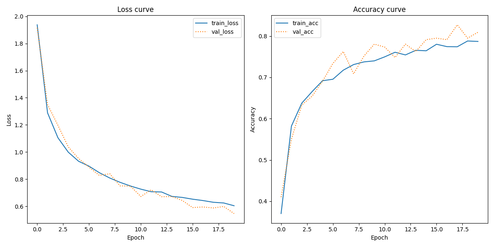

# Assignment 3: Transfer learning with pretrained CNNs

## About

This project uses transfer learning with the pre-trained ``VGG16`` model to classify images from the ``Tobacco3482`` dataset, comprising scanned black-and-white images across ten classes. Additionally, the ``ImageDataGenerator`` from ``tensorflow`` augments the data due to the small size of some classes in the Tobacco3482 dataset.

However, before classification, the dataset is split into a train-and-test set using ``scikit-learn``, and the model is modified by removing its existing classification layers and adding custom layers using tensorflow, compiling the layers, and adding labels for the different categories. 

The ``src`` directory contains two scripts:

-  **transfer_learning.py:** Trains the CNN and generates a classification report.

- **plotting_tools.py:** Plots the loss curve.


### Data

Download the [Tobacco3482](https://www.kaggle.com/datasets/patrickaudriaz/tobacco3482jpg) dataset from Kaggle and save it in the ``in`` directory. However, the download contains a second Tobacco3482 directory within it, so be sure to remove that before running the code to prevent errors.

### Model


*The VGG16 model architecture without the classification layers*

| Parameter      | Value        | Type |
|----------------|--------------|------|
| include_top    | False        | bool |
| pooling        | avg          | str  |
| input_shape    | (224, 224, 3)| int  |        


For this project, the [VGG16](https://keras.io/api/applications/vgg/) model is loaded without the top classification layers, marking the remaining layers as nontrainable while adding the following layers to enhance its performance and prevent overfitting.

|Layer (type)       |Output Shape|Number of Parameters|
|-------------------|------------|--------------------|
|flatten            |(None, 512) |0                   |
|batch_normalization|(None, 512) |2048                |
|dense (relu)       |(None, 128) |65664               |
|dropout            |(None, 128) |0                   |
|dense_1 (softmax)  |(None, 10)  |1290                |

Afterwards, the model is compiled using the ``Adam`` optimizer with an ``ExponentialDecay()`` learning rate that fits the optimizer. The loss function is set to ``categorical_crossentropy`` with ``accuracy`` used as the evaluation metric.

##  File Structure

```
└── assignment_3
        |
        ├── in
        │   └── Tobacco3482 (contains 3482 files)
        │      
        ├── out
        |   ├── classification_report.txt
        |   └── loss_curve.png
        |
        ├── src
        │   ├── plotting_tools.py
        │   └── transfer_learning.py
        │     
        ├── readme.md
        ├── requirements.txt
        ├── run.sh
        └── setup.sh
```
## Usage

If you want replicate this project, follow the steps outlined below. The instructions will guide you through setting up the environment, running the script, and plotting the results while helping you understand the available command-line options for customizing the training process. 

### Pre-Requisites

*Please makes sure to install the following requirements before running the script.*

**Python**: version 3.12.3

### Installation

**1.** Clone the repository using Git.
```sh
git clone https://github.com/trinerye/visual_analytics_2024.git
```

**2.** Change directory to the assignment folder.
```sh
cd assignment_3
```

**3.** Run ``setup.sh`` to create an environment and install the dependencies needed for this project. 
```sh
bash setup.sh
```
**4.** Run ``run.sh`` to activate the environment and run the main script. 
```sh
bash run.sh
```
```sh
...
# Activate the environment (Unix/macOS)
source ./A3_env/bin/activate

# Run the code
python src/transfer_learning -e 20 -p

# Deactivate the enviroment
deactivate
```

### Command Line Interface  

This project supports several command-line flags which customizes the training process. *See table for reference.*

|Flag      |Shorthand|Description                                 |Type|Required|
|----------|---------|--------------------------------------------|----|--------|
| --epochs | -e      |Number of epochs you want the model to run  |int |TRUE    |
| --print  | -p      |Saves the model summary in the out directory|bool|FALSE   |

## Results 

In the ``out`` directory, you can find a plot of the loss and accuracy curve illustrating the model's performance on the training and validation data, together with a classification report showing how accurate the model is at predicting which of the ten classes the test data belongs to. 



In the first plot, **the training and validation loss curves decrease**, which tells us that the model is learning and adjusting its weights accordingly to correct errors and enhance overall performance. However, in the second plot, **the training and validation accuracy curves increase**, which indicates that the model becomes more accurate in its predictions as the epochs progress. Furthermore, the short distance between the training and the validation curve indicates that the model generalizes the validation data well without overfitting the training data (Muralidhar, 2023). **In conclusion, while loss decreases, accuracy increases, suggesting that the model is effectively learning the patterns in the data.** 

When examining the classification report in the ``out`` directory, we see that the test data is unbalanced, with some classes being larger than others. In such instances, the weighted average might be the preferred metric as it accounts for this difference in the dataset, giving “more importance to the classes that have more data” (Prasanna, 2024).

|Metrics         |Precision   |Recall|F1-Score|
|----------------|------------|------|--------|
|weighted average|0.74        |0.73  |0.73    |

Nevertheless, the model performs well on the test data with a weighted F1-score of 0.73, suggesting that the model is significantly accurate at predicting the correct image labels.

### Limitations and future improvements 

- In the future, to reduce the impact that some classes have compared to others, the data should be split so that the original class proportions of the Tobacco3482 dataset are preserved, thus ensuring that the distribution in the subsets remains true to the original content.

- Since the VGG16 model has a complex architecture that requires extensive fine-tuning to enhance its performance, conducting a grid search using the ``GridSearchCV`` function from scikit-learn could possibly reduce the time spent fine-tuning the model.

## Reference

Muralidhar, K. S. V. (2023, July 7). Learning Curve to identify Overfitting and Underfitting in Machine Learning. Medium. https://towardsdatascience.com/learning-curve-to-identify-overfitting-underfitting-problems-133177f38df5

Prasanna, C. (2024, April 21). Classification Report Explained—Precision, Recall, Accuracy, Macro average, and Weighted Average. Medium. https://medium.com/@chanakapinfo/classification-report-explained-precision-recall-accuracy-macro-average-and-weighted-average-8cd358ee2f8a


