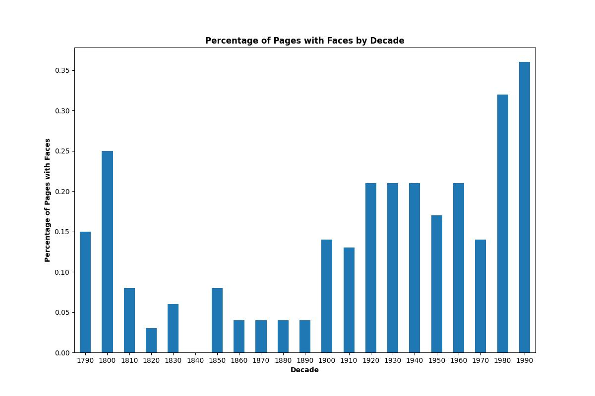
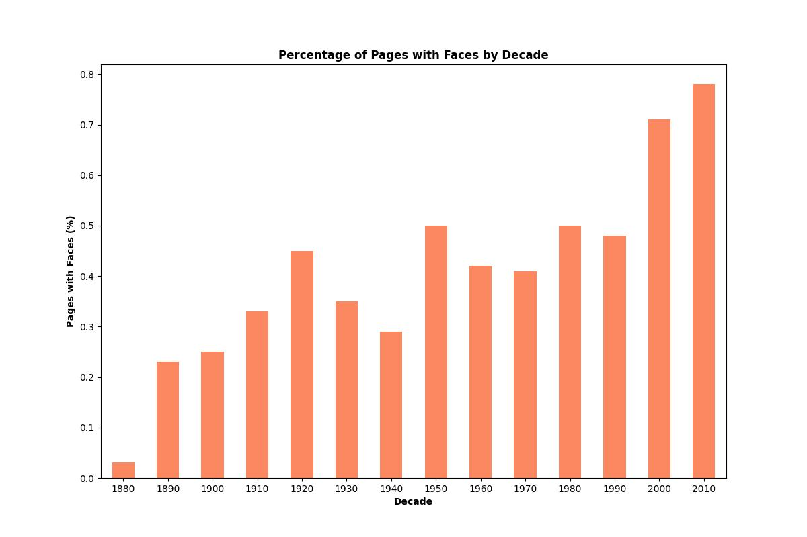
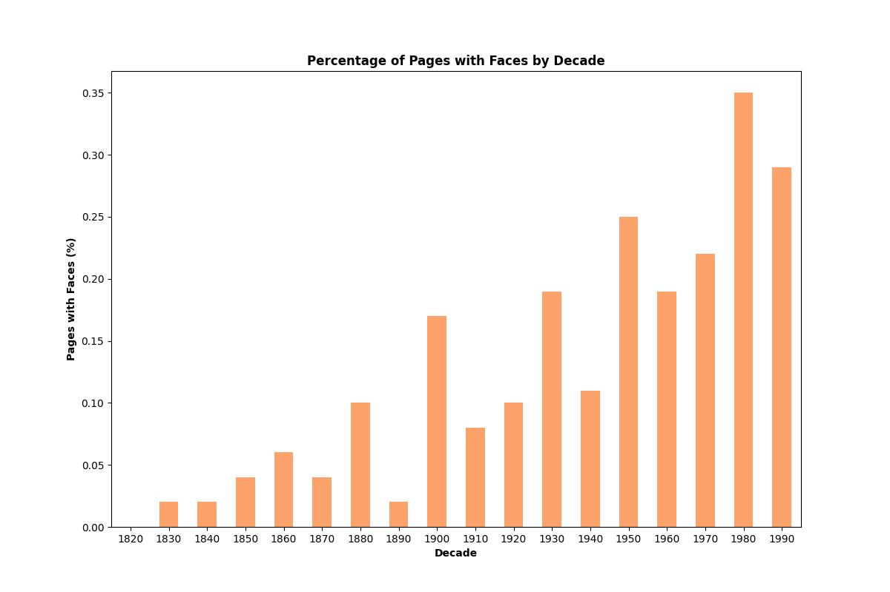

# Assignment 4: Detecting faces in historical newspapers

## About

This project uses transfer learning with the pre-trained ``VGG16`` model to classify images from the ``Tobacco3482`` dataset, comprising scanned black-and-white images across ten classes. Additionally, the ``ImageDataGenerator`` from ``tensorflow`` augments the data due to the small size of some classes in the Tobacco3482 dataset.

However, before classification, the dataset is split into a train-and-test set using ``scikit-learn``, and the model is modified by removing its existing classification layers and adding custom layers using tensorflow, compiling the layers, and adding labels for the different categories. 

The ``src`` directory contains two scripts:

-  **face_detection.py:** 

- **plotting_tools.py:** 


### Data

Download the historical Swiss newspapers used for this project [here](https://zenodo.org/records/3706863). You also need to download the images.zip file, which contains the three image datasets: the Journal de Genève (JDG, 1826-1994), the Gazette de Lausanne (GDL, 1804-1991), and the Impartial (IMP, 1881-2017). Once downloaded, copy the GDL, IMP, and JDG folders and place them in the ``in`` directory. 


### Model

This project was built using [MTCNN](https://medium.com/@danushidk507/facenet-pytorch-pretrained-pytorch-face-detection-mtcnn-and-facial-recognition-b20af8771144), a Multi-task Cascaded Convolutional Network, from facenet_pytorch, which consists of the following networks: 

>- A **Proposal Network (P-Net)** that detects *"candidate face regions in an image"* (DhanushKumar, 2023).

>- An **Output Network (O-Net)** that *"refines the candidate regions by locating facial landmarks such as the eyes, nose, and mouth"* (DhanushKumar, 2023)

>- A **Refine Network (R-Net)** that *"aligns the detected faces based on the positions of the facial landmarks"* (DhanushKumar, 2023)

We use the model to produce the bounding boxes, although the vectors are not used directly in the assignment. Instead, we count the frequency of bounding boxes, using them to indicate whether the image contains a face and how many. 

##  File Structure

```
└── assignment_4
        |
        ├── in
        │   └── newspapers
        |         ├── GDL (contains ... images)
        |         ├── IMP (contains ... images)     
        |         └── JDG (contains ... images)
        |
        ├── out
        |   ├── GDL 
        |   |    ├── GDL_distribution_across_decades.jpg
        |   |    ├── GDL_newspaper.csv
        |   |    └── GDL_sorted_newspaper_information.csv
        |   |
        |   ├── IMP
        |   |   ├── IMP_distribution_across_decades.jpg
        |   |   ├── IMP_newspaper.csv
        |   |   └── IMP_sorted_newspaper_information.csv
        |   |
        |   └── JDG
        |       ├── JDG_distribution_across_decades.jpg
        |       ├── JDG_newspaper.csv
        |       └── JDG_sorted_newspaper_information.csv
        |
        ├── src
        │   ├── face_detection.py
        │   └── plotting_tools.py
        │     
        ├── readme.md
        ├── requirements.txt
        ├── run.sh
        └── setup.sh
```
## Usage

To run this project, follow the steps outlined below. These instructions will guide you through setting up the environment, running the script, saving and plotting the results while helping you understand the available command-line options for customizing the training process. 

### Pre-Requisites

*Please makes sure to install the following requirements before running the script.*

**Python**: version 3.12.3

### Installation

**1.** Clone the repository using Git.
```sh
git clone https://github.com/trinerye/visual_analytics_2024.git
```

**2.** Change directory to the assignment folder.
```sh
cd assignment_4
```

**3.** Run ``setup.sh`` to create an environment and install the dependencies needed for this project. 
```sh
bash setup.sh
```
**4.** Run ``run.sh`` to activate the environment and run the main script. 
```sh
bash run.sh
```
```sh
...
# Activate the environment (Unix/macOS)
source ./A4_env/bin/activate

# Run the code
python src/face_detection.py -p 

# Deactivate the enviroment
deactivate
```

### Command Line Interface  

This project supports several command-line flags to customize the training process. *See table for reference.*

|Flag      |Shorthand|Description                                                      |Type |Required|
|----------|---------|-----------------------------------------------------------------|-----|--------|
| --print  | -p      |Saves an unedidted version of the csv file in the out directory  |bool |FALSE   |

## Results 

Write something here

<div style="display: flex; justify-content: space-around;">
    
    
    
</div>

Describe what you see

### Limitations and future improvements 
Rescale the images, dog skal man være opmærksom på at det kan gøre det endnu svære for modellen at genkende ansigter

## References

DhanushKumar, (2023, September 9), Facenet-pytorch | Pretrained Pytorch face detection (MTCNN) and facial recognition…, Medium, https://medium.com/@danushidk507/facenet-pytorch-pretrained-pytorch-face-detection-mtcnn-and-facial-recognition-b20af8771144 

