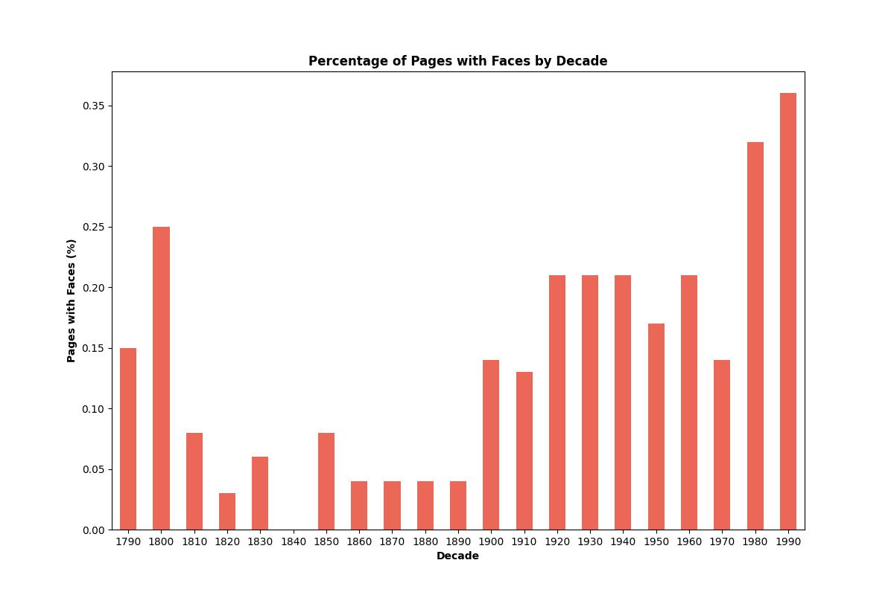

# Assignment 4: Detecting faces in historical newspapers

## About

This project uses the ``MTCNN`` from ``facenet_pytorch`` to detect faces in old Swiss newspapers, specifically the *Journal de Genève* (JDG, 1826-1994), the *Gazette de Lausanne* (GDL, 1804-1991), and *the Impartial* (IMP, 1881-2017). The objective is to [look for changing patterns in print media](https://github.com/CDS-AU-DK/cds-visual/tree/main/assignments/assignment4), as these likely change over time due to technological advancements.

The ``src`` directory contains two scripts:

-  **face_detection.py:** Uses the MTCNN to detect faces in images, returning the bounding boxes surrounding them and calculating both the frequency of boxes and the percentage of pages with faces per decade. 

- **plotting_tools.py:** Plots the results as a barplot, showing the percentage of pages with faces per decade.


### Data

Download the historical Swiss newspapers used for this project [here](https://zenodo.org/records/3706863). You need to download the images.zip file, rename the ``images`` folder to ``newspapers`` and save it in the ``in`` directory. 

### Model

This project was built using [MTCNN](https://medium.com/@danushidk507/facenet-pytorch-pretrained-pytorch-face-detection-mtcnn-and-facial-recognition-b20af8771144), a Multi-task Cascaded Convolutional Network, from facenet_pytorch, which consists of the following networks: 

- A **Proposal Network (P-Net)** that detects *"candidate face regions in an image"* (DhanushKumar, 2023).

- An **Output Network (O-Net)** that *"refines the candidate regions by locating facial landmarks such as the eyes, nose, and mouth"* (DhanushKumar, 2023)

- A **Refine Network (R-Net)** that *"aligns the detected faces based on the positions of the facial landmarks"* (DhanushKumar, 2023)

Although the vector values are not used directly in the assignment, we use the model to produce the bounding boxes and count their frequency. We use this information to determine  whether the image contains a face and how many.

##  File Structure

```
└── assignment_4
        |
        ├── in
        │   └── newspapers
        |       ├── GDL
        |       ├── IMP 
        |       └── JDG 
        |
        ├── out
        |   ├── GDL 
        |   |   ├── GDL_distribution_across_decades.jpg
        |   |   ├── GDL_newspaper.csv
        |   |   └── GDL_sorted_newspaper_information.csv
        |   |
        |   ├── IMP
        |   |   ├── IMP_distribution_across_decades.jpg
        |   |   ├── IMP_newspaper.csv
        |   |   └── IMP_sorted_newspaper_information.csv
        |   |
        |   └── JDG
        |       ├── JDG_distribution_across_decades.jpg
        |       ├── JDG_newspaper.csv
        |       └── JDG_sorted_newspaper_information.csv
        |
        ├── src
        │   ├── face_detection.py
        │   └── plotting_tools.py
        │     
        ├── readme.md
        ├── requirements.txt
        ├── run.sh
        └── setup.sh
```
## Usage

To run this project, follow the steps outlined below. These instructions will guide you through setting up the environment, running the script, saving and plotting the results while helping you understand the available command-line options for customizing the training process. 

### Pre-Requisites

*Please make sure to install the following requirements before running the script.*

**Python**: version 3.12.3

### Installation

**1.** Clone the repository using Git.
```sh
git clone https://github.com/trinerye/visual_analytics_2024.git
```

**2.** Change the directory to the assignment folder.
```sh
cd assignment_4
```

**3.** Run ``setup.sh`` to create an environment and install the dependencies needed for this project. 
```sh
bash setup.sh
```
**4.** Run ``run.sh`` to activate the environment and run the main script. 
```sh
bash run.sh
```
```sh
...
# Activate the environment (Unix/macOS)
source ./A4_env/bin/activate

# Run the code
python src/face_detection.py -p 

# Deactivate the environment
deactivate
```

### Command Line Interface  

This project supports several command-line flags to customize the training process. *See table for reference.*

|Flag      |Shorthand|Description                                                      |Type |Required|
|----------|---------|-----------------------------------------------------------------|-----|--------|
| --print  | -p      |Saves an unedited  version of the csv file in the out directory  |bool |FALSE   |

## Results 
In the ``out`` directory, each newspaper has a folder containing a plot and an unedited and sorted CSV file of the results.

According to the three plots, the percentage of pages containing faces increases over time, likely due to technological advancements such as cameras, video recorders, and telephones, causing modern newspapers to contain more images than their older counterparts.

<div style="display: flex; justify-content: space-around;">
    
    
    
</div>

A limitation of this approach is that the model is highly inaccurate. It misses several faces in images with multiple people while simultaneously detecting faces that are not there, resulting in false positives. Having investigated the images myself, this is the case with many of the earlier images from 1790 to the late 1800s, as the faces, although cartoons, start appearing around the 1870s for JDG, 1890s for IMP, and 1900s for GDL.

Such errors might occur due to the poor quality of the images to which we apply face detection, as many of the images are filled with noise, which likely affects the model’s performance. 

### Limitations and future improvements 

- To prevent this, one might need to preprocess the images even better before feeding them to the model, experimenting with different thresholds from opencv to reduce noise.

- Also, the run time is extensive, taking nearly four hours to run on a 16-CPU machine. Rescaling the images will likely reduce the time spent, although the potential loss of information might make it harder for the model to detect faces. 

## References

DhanushKumar, (2023, September 9), Facenet-pytorch | Pretrained Pytorch face detection (MTCNN) and facial recognition…, Medium, https://medium.com/@danushidk507/facenet-pytorch-pretrained-pytorch-face-detection-mtcnn-and-facial-recognition-b20af8771144 

